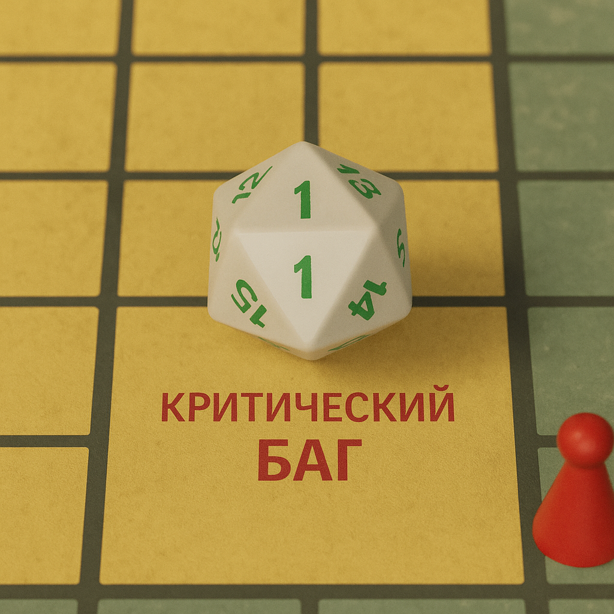

  <h1>👋 Привет! Меня зовут Максим</h1>

  QA-инженер, практикуюсь в ручном тестировании веб-продуктов, мобильных приложений и API. 
  В работе использую Postman, Swagger, Charles, базы данных, баг-трекеры и DevTools. 
  Ценю структурность, внимательность к деталям и глубокое понимание продукта. 
  Постоянно совершенствую навыки и нацелен на рост в профессии.

<h2 align="center">
 <a href="https://github.com/MaximKuznetcov/MaximKuznetcov/blob/main/Кузнецов_resume.pdf?raw=true" target="_blank">Моё резюме</a>
</h2>

<h2 align="center">📬 Связь</h2>

  <a href="mailto:maksimkuznetsovqa@mail.ru" target="_blank">
     Email
  </a> • 
  <a href="https://t.me/JooMaks" target="_blank">
     Telegram
  </a> • 
  <a href="https://www.linkedin.com/in/maksim-kuznetcov" target="_blank">
     LinkedIn
  </a>

<h2>💬 Немного обо мне</h2>

<table>
  <tr>
    <td>
      <ul>
        <li>🎲 Увлекаюсь настольными играми — от дуэльных боёв до стратегий</li>
        <li>🕵️ Даже в повторной партии проверяю, не «сломалось» ли что-нибудь в правилах</li>
      </ul>
    </td>
    <td>
      
    </td>
  </tr>
</table>

<h2>🛠️ Инструменты</h2>

  <!-- сюда вставлены иконки инструментов, ты можешь оставить как есть -->
  <!-- ... -->

<h2>📂 Test Artifacts</h2>
<table align="center">
  <tr>
    <th>Категория</th>
    <th>Ссылка</th>
  </tr>
  <tr><td>Теория и тест-дизайн</td><td><a href="https://github.com/MaximKuznetcov/theory">Перейти</a></td></tr>
  <tr><td>Техники тест-дизайна</td><td><a href="https://github.com/MaximKuznetcov/design">Перейти</a></td></tr>
  <tr><td>Веб-документация</td><td><a href="https://github.com/MaximKuznetcov/docs">Перейти</a></td></tr>
  <tr><td>Веб-тестирование</td><td><a href="https://github.com/MaximKuznetcov/Web">Перейти</a></td></tr>
  <tr><td>API и SOAP тесты</td><td><a href="https://github.com/MaximKuznetcov/api">Перейти</a></td></tr>
  <tr><td>Базы данных</td><td><a href="https://github.com/MaximKuznetcov/database">Перейти</a></td></tr>
  <tr><td>Git и Bash</td><td><a href="https://github.com/MaximKuznetcov/git_bash">Перейти</a></td></tr>
  <tr><td>Мобильное тестирование</td><td><a href="https://github.com/MaximKuznetcov/mobile-">Перейти</a></td></tr>
</table>

Спасибо, что заглянули! 😊
